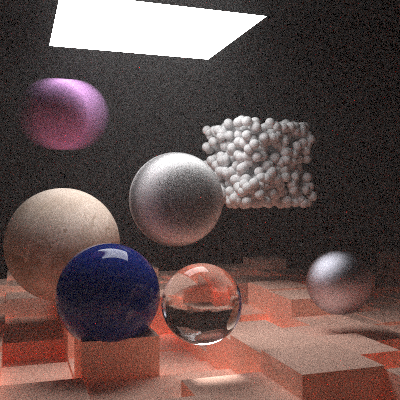

# Ray Tracer in Rust

Ray tracer written/translated from the C++ code in [Ray Tracing in One Weekend](https://raytracing.github.io/books/RayTracingInOneWeekend.html) book. 

Final render scene is shown below. All other renders made while working through the book can be found in output folder in ppm and png format. Exports in png were created with gimp.

This also includes the code for the second book the series, [Ray Tracing: the Next Week](https://raytracing.github.io/books/RayTracingTheNextWeek.html). 

Final render for the second book is shown below.

## Reference
[_Ray Tracing in One Weekend_](https://raytracing.github.io/books/RayTracingInOneWeekend.html)

[_Ray Tracing: the Next Week_](https://raytracing.github.io/books/RayTracingTheNextWeek.html)
