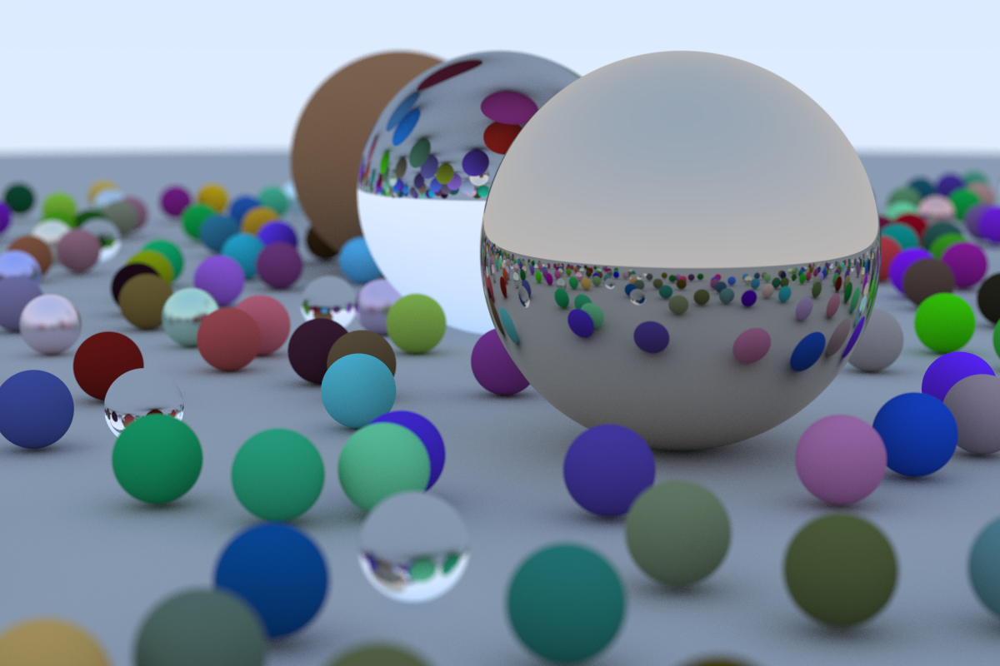
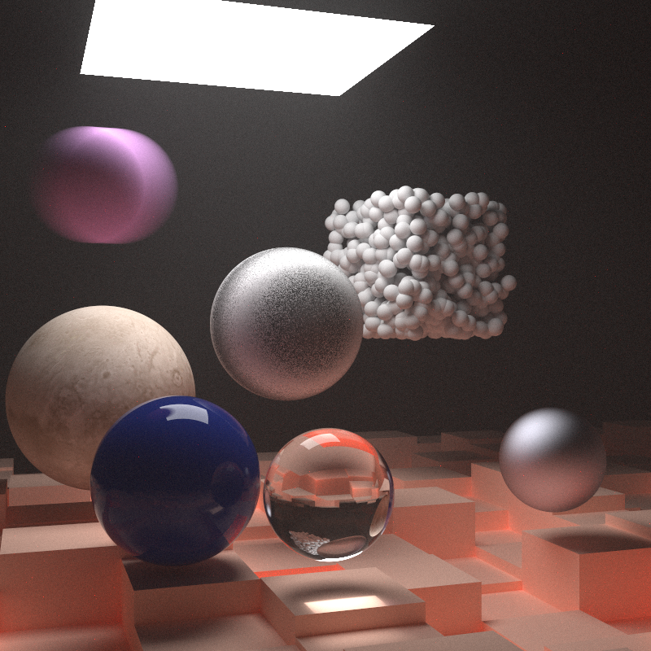
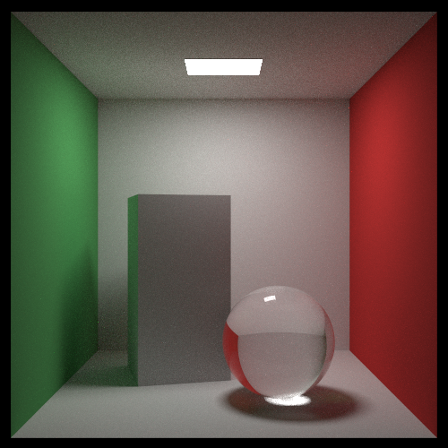

# Ray Tracer in Rust

Ray tracer written/translated from the C++ code in [Ray Tracing in One Weekend](https://raytracing.github.io/books/RayTracingInOneWeekend.html) book. 

*The binary files to build and run the code for the first and second book are currently not functional due to refactoring done in the third book to key dependencies*

Final render scene is shown below. All other renders made while working through the book can be found in output folder in ppm and png format. Exports in png were created with gimp.

This also includes the code for the second book in the series, [Ray Tracing: the Next Week](https://raytracing.github.io/books/RayTracingTheNextWeek.html). 

Final render for the second book is shown below.

And now, it includes the code for the last book in the series, [_Ray Tracing: The Rest of Your Life_](https://raytracing.github.io/books/RayTracingTheRestOfYourLife.html). Also, the final render of book 3 is below.

## Reference
[_Ray Tracing in One Weekend_](https://raytracing.github.io/books/RayTracingInOneWeekend.html)

[_Ray Tracing: the Next Week_](https://raytracing.github.io/books/RayTracingTheNextWeek.html)

[_Ray Tracing: The Rest of Your Life_](https://raytracing.github.io/books/RayTracingTheRestOfYourLife.html)

